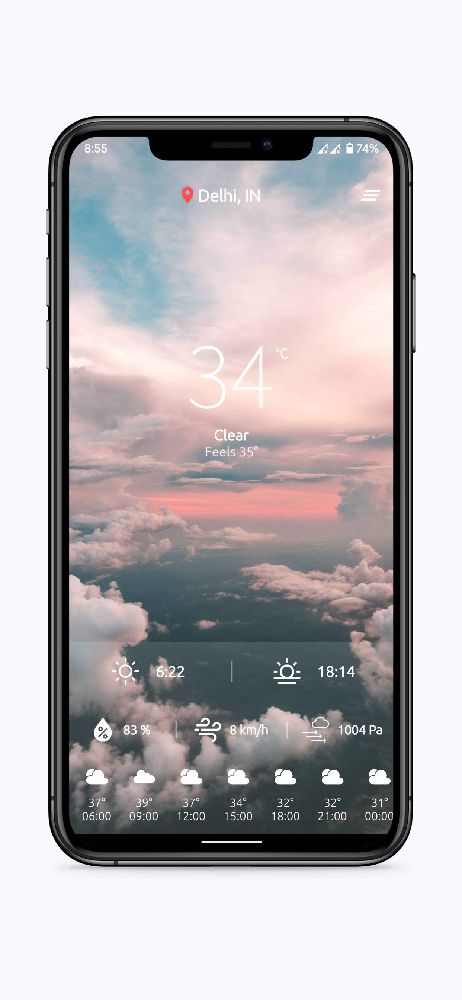
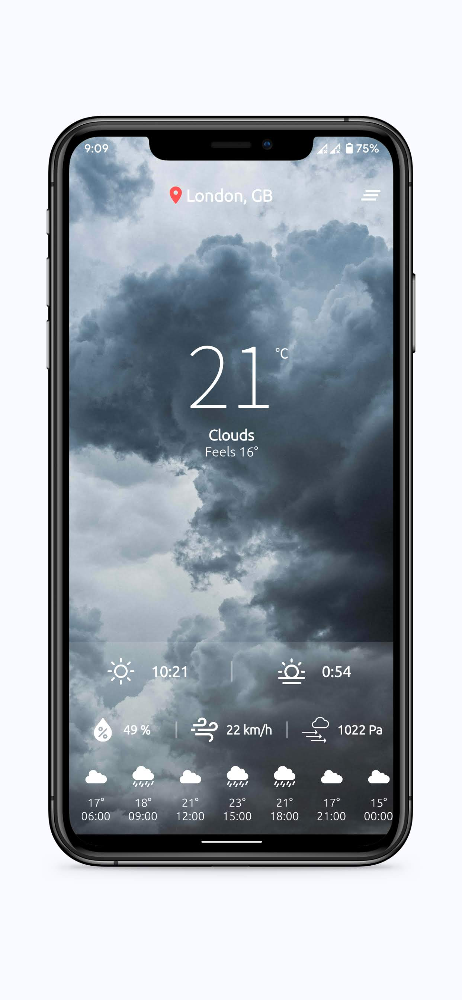
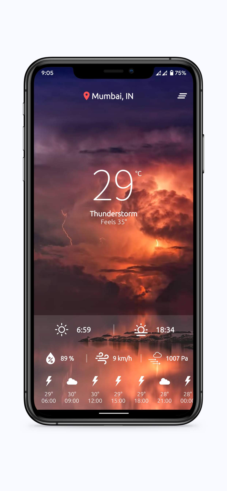

# Weather app

**Screenshot**

**Requirements**
- Location Access
- Internet connection
- Storage requirement < 30mb

**Highlights**
- Use [OpenWeatherMap] API
- Beautiful Ui across screens
- Cross Platform
- Geo-location based weather fetching
- Manual search for weather update of a particular city

**Author**
<a href="https://github.com/vineetk242000" style="text-decoration:none">Vineet Kumar</a>

